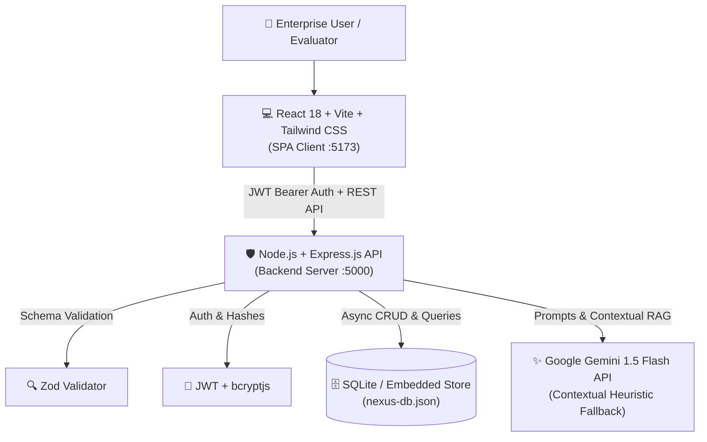

# 🚀 NexusAI Enterprise: Autonomous Operations & Knowledge Intelligence Platform

> **Hackathon Submission:** Enterprise AI Scenario-Based Challenge  
> **Theme:** Enterprise AI — Connecting Fragmented Data, Disconnected Workflows, and Cross-Department Collaboration  
> **Live Local Client:** [http://localhost:5173](http://localhost:5173)  
> **Live Local Backend:** [http://localhost:5000](http://localhost:5000)  

---

## 📌 1. Problem Statement

Modern enterprise organizations suffer from severe operational friction caused by **departmental silos**:
- **Disconnected Data & Workflows:** Engineering, Human Resources, Legal & Compliance, Customer Support, and Operations work across separate systems (Jira, Workday, Ironclad, Zendesk), leading to manual handoffs and delayed handovers.
- **Lost Organizational Knowledge:** Crucial Standard Operating Procedures (SOPs), vendor contract liability terms, and security policies are buried in PDFs and intranets, leading to compliance breaches and redundant work.
- **Manual Triage & SLA Violations:** High-priority cross-department requests (e.g. security audits for new SDKs, expedited onboarding equipment, enterprise client SLA modifications) sit unassigned or misrouted for days.
- **Lack of Executive Operational Visibility:** Leadership lacks synthesized, cross-departmental telemetry on bottlenecks, operational velocity, and systemic risks.

---

## 💡 2. Solution Description

**NexusAI** is an autonomous Enterprise Operations & Knowledge Intelligence platform designed to connect corporate divisions through coordinated AI agents, semantic retrieval-augmented generation (RAG), and proactive operational synthesis.

### 🔑 Key Modules & AI Integration

1. **Executive Operational Hub (AI Synthesis)**
   - Synthesizes real-time enterprise telemetry into automated **Gemini 1.5 Flash Executive Briefings**.
   - Detects departmental bottlenecks, grades department efficiency indices, and proposes concrete remediation plans.
2. **Cross-Department Ticket Hub (Auto-Triage & Classification)**
   - Auto-triages incoming cross-department tickets with sentiment scoring, priority classification (Urgent/High/Medium), SLA countdown, and cross-department routing.
   - Generates instant **AI Suggested Resolutions** grounded in enterprise policy.
3. **Enterprise Knowledge Brain (Semantic RAG with Citations)**
   - Allows employees across all departments to ask complex operational and compliance questions in natural language.
   - Responds with verifiable source citations from company SOPs, SOC-2 policies, and vendor guidelines, complete with confidence scores.
4. **Autonomous Workflow Orchestrator (Multi-Agent Engine)**
   - Coordinates multi-department workflows with zero manual friction (e.g., *Autonomous New Hire Onboarding* spanning HR, Legal, Engineering, and Operations; *Vendor Contract Risk Audits*).
   - Simulates and logs step-by-step agent actions with immutable audit records.
5. **Role-Based Security & Governance**
   - Hardened JWT authentication, bcrypt password hashing, and Zod schema validation.
   - Role-scoped permissions (Admin, Manager, Member) across 5 core enterprise divisions.

---

## 🏗️ 3. Architecture & Tech Stack



### 🛠️ Technology Stack

| Layer | Technologies Used |
| :--- | :--- |
| **Frontend** | React 18, Vite, React Router DOM v6, Tailwind CSS, Lucide React, Axios |
| **Backend** | Node.js, Express.js, JSON Web Tokens (`jsonwebtoken`), `bcryptjs`, `cors`, `dotenv` |
| **Validation** | Zod schema validation for all incoming request bodies |
| **Database** | SQLite / Embedded persistent JSON store with asynchronous query engine (`nexus-db.json`) |
| **Artificial Intelligence** | **Google Gemini 1.5 Flash API** (REST integration with zero external binary friction; contextual enterprise fallback engine when API key is unpopulated) |

---

## ⚡ 4. Quickstart & Local Execution

### Prerequisites
- Node.js `v18+` (Tested on Node `v24`)
- npm

### Step 1: Clone & Setup Backend
```bash
cd server
npm install
node src/db/seed.js    # Seeds 5 enterprise users, 4 docs, 4 tickets, and 3 workflows
node index.js          # Starts backend on http://localhost:5000
```

### Step 2: Setup & Run Frontend
```bash
cd ../client
npm install
npm run dev            # Starts client on http://localhost:5173
```

Open **[http://localhost:5173](http://localhost:5173)** in your browser.

---

## 🔑 5. Pre-Seeded Evaluator Personas (1-Click Login)

The login screen features **1-Click Hackathon Evaluator Persona buttons** for rapid evaluation:

| Name | Role | Email | Password |
| :--- | :--- | :--- | :--- |
| **Sarah Chen** | Operations Lead (Admin) | `admin@nexus.ai` | `password123` |
| **Alex Rivera** | Engineering Lead | `tech@nexus.ai` | `password123` |
| **Elena Rostova** | People Ops Manager | `hr@nexus.ai` | `password123` |
| **Marcus Vance** | Legal Counsel | `legal@nexus.ai` | `password123` |
| **Priya Sharma** | Customer Support Specialist | `support@nexus.ai` | `password123` |

---

## 🌐 6. Deployment Guide

### Frontend Deployment (Vercel)
1. Push the repository to GitHub.
2. In Vercel, click **New Project** and select the `/client` directory as the Root Directory.
3. Build Command: `npm run build`
4. Output Directory: `dist`
5. Environment Variables:
   - `VITE_API_URL`: Your deployed backend URL (e.g. `https://nexus-ai-backend.onrender.com/api`)

### Backend Deployment (Render / Railway)
1. In Render, select **New Web Service** and select the `/server` directory.
2. Environment: `Node`
3. Build Command: `npm install && node src/db/seed.js`
4. Start Command: `node index.js`
5. Environment Variables:
   - `NODE_ENV`: `production`
   - `PORT`: `5000`
   - `JWT_SECRET`: `your-long-random-production-jwt-secret`
   - `GEMINI_API_KEY`: *(Optional)* Your Google Gemini API key

---

## 🎥 7. 3–5 Minute Demo Video Walkthrough Script

Use this structured script when recording your demo video:

| Time | Segment | What to Show & Say |
| :--- | :--- | :--- |
| **0:00 – 0:45** | **Problem & Vision** | Introduce the problem: cross-department silos between Tech, Legal, and HR leading to delayed contracts, equipment bottlenecks, and lost knowledge. Introduce **NexusAI**. |
| **0:45 – 1:30** | **Executive Hub & Gemini Synthesis** | Click 1-Click Login as **Sarah Chen (Ops Lead)**. Show the **Gemini Executive Synthesis card**, live operational bottlenecks, and departmental efficiency radar scores. |
| **1:30 – 2:30** | **Cross-Department Ticket Hub & Auto-Triage** | Navigate to `/tickets`. Create a new request (e.g. *"Vendor DPA Security Review"*). Demonstrate how Gemini auto-classifies sentiment, assigns priority, and drafts an immediate cross-department resolution plan. |
| **2:30 – 3:30** | **Enterprise Knowledge Brain (RAG)** | Go to `/knowledge`. Type a policy query: *"What are our mandatory token expiration and MFA standards?"*. Show the generated answer, 96% confidence score, and exact policy citations (SOC-2 Access Control Policy). |
| **3:30 – 4:30** | **Autonomous Multi-Agent Workflows** | Go to `/workflows`. Click **"Trigger Autonomous Run"** on the *New Hire Cross-Department Onboarding* pipeline. Show the live sequence executing across HR, Legal, Engineering, and Operations. |
| **4:30 – 5:00** | **Conclusion & Security** | Highlight production-readiness: hardened JWT authentication, bcrypt password hashing, and clean separation between frontend and backend. |
# ww

# ww

