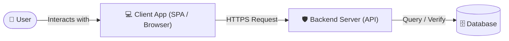
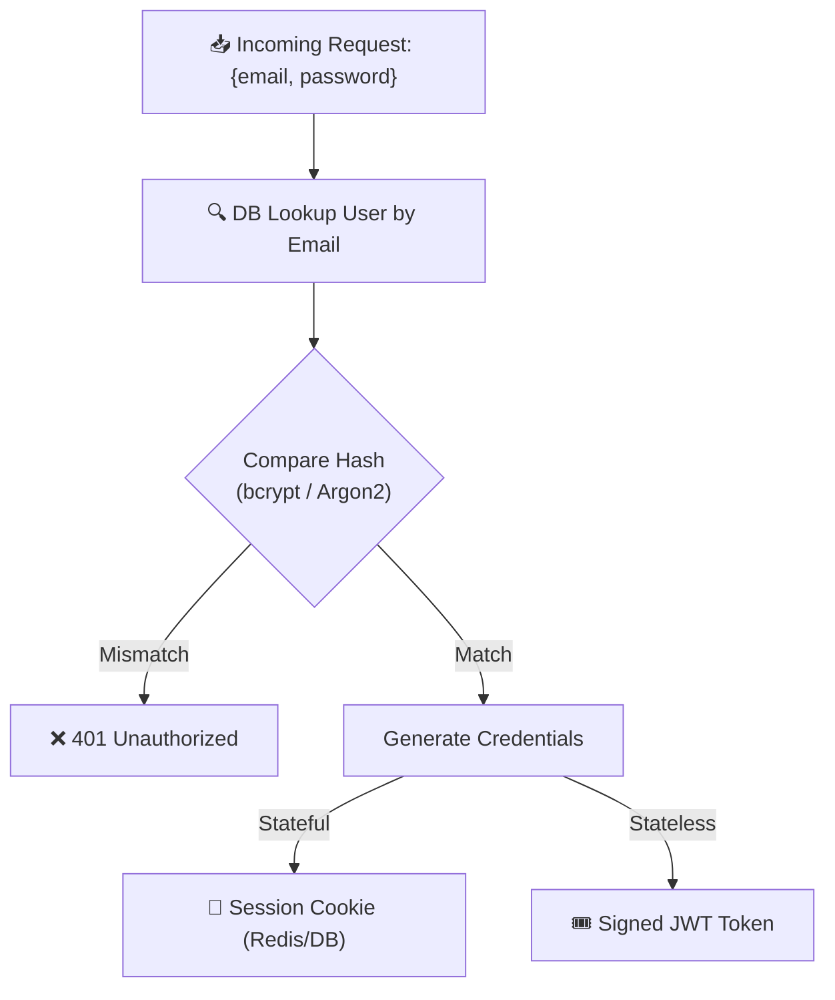

# Presentation Guide: Understanding Web Authentication Architecture

**Topic:** Fundamentals of Web Authentication & Secure Login Flows  
**Target Duration:** ~5 Minutes  
**Audience:** Developers, Engineering Students, Technical Judges, or Hackathon Attendees  

---

## Slide 1: Introduction & The Goal of Authentication
- **Time:** `0:00 - 1:00` (60 sec)
- **Visuals:** High-level system architecture showing User, Client Browser (Frontend), and Backend Auth Server / Database.
- **Core Question:** *"Is this user who they claim to be?"*
- **Key Points:**
  - Authentication (AuthN - *who you are*) vs Authorization (AuthZ - *what you can do*).
  - Common across all platforms: Social media, E-Commerce, SaaS, Enterprise systems.
  - Core triad: Secure identity verification, permission granting, protecting sensitive assets.
- **Speaker Cue:** Keep the opening energetic and clear. Establish the foundational question within the first 15 seconds.

---

## Slide 2: The Client-Side Flow (The Frontend)
- **Time:** `1:00 - 2:15` (75 sec)
- **Visuals:** Interactive mock login form with email & password, client-side validation triggers, TLS/HTTPS lock indicator.
- **Key Points:**
  1. **Input Collection:** Capturing email/username and secret password safely.
  2. **Client-Side Validation:** Format validation (regex for email, minimum password length) to deliver instant user feedback and eliminate wasted roundtrips.
  3. **Secure Transmission (TLS/HTTPS):** Encrypting payload in transit to prevent Man-in-the-Middle (MITM) packet sniffing.
- **Speaker Cue:** Point out that client-side validation is for UX and performance, NOT security, because requests can be spoofed directly to the API.

---

## Slide 3: The Server-Side Processing (The Backend)
- **Time:** `2:15 - 3:30` (75 sec)
- **Visuals:** Pipeline flow showing Credential Lookup -> Cryptographic Hashing & Salt Verification -> **Live JWT Playground & Tamper Demo**.
- **Interactive Demonstrations on Slide 3:**
  1. **Password Hashing Tab:** Live slow hashing calculation, random salt generation, bcrypt/Argon2 comparison.
  2. **Live JWT Playground Tab:** Real-time Base64URL encoder/decoder, HMAC-SHA256 signature generator, and one-click *"Test Tampering (Escalate to Admin)"* demo showing cryptographic rejection.
  3. **Session vs JWT Tab:** Matrix comparison (Stateful DB/Redis sessions vs Stateless signed claims).
- **Key Points:**
  1. **Credential Lookup:** Fetching record by unique identifier.
  2. **Password Hashing & Salting:** Never plaintext! Use slow, CPU/memory-hard algorithms (bcrypt, Argon2id, PBKDF2) with cryptographic salts.
  3. **Session Mechanism Selection:**
     - **Stateful (Session Cookies):** Session ID stored in Redis/DB; fast revocation.
     - **Stateless (JWT):** Cryptographically signed claims (`header.payload.signature`); scalable across microservices.
- **Speaker Cue:** Click the *"Test Tampering"* button during Slide 3 to show how altering a user claim (e.g., claiming `"role": "admin"`) immediately causes the signature verification to fail (`TAMPER DETECTED ⚠️`), proving that JWTs cannot be forged without the server's private secret!

---

## Slide 4: Session Persistence & Security Best Practices
- **Time:** `3:30 - 4:15` (45 sec)
- **Visuals:** Security checklist with Cookie Flags (`HttpOnly`, `Secure`, `SameSite=Strict/Lax`), Token Lifecycle (Access Token + Refresh Token flow).
- **Key Points:**
  1. **Storage Hygiene:** Avoid `localStorage` for sensitive tokens due to XSS vulnerability. Prefer `HttpOnly` cookies.
  2. **Cookie Attributes:**
     - `HttpOnly`: Prevents client-side JS read access.
     - `Secure`: Transmitted only over HTTPS.
     - `SameSite=Strict/Lax`: Blocks Cross-Site Request Forgery (CSRF).
  3. **Lifecycle & Expiry:** Short-lived access tokens (5–15 mins) paired with rotating refresh tokens.
- **Speaker Cue:** Emphasize the defense-in-depth approach (XSS + CSRF protections).

---

## Slide 5: Conclusion & Q&A
- **Time:** `4:15 - 5:00` (45 sec)
- **Visuals:** The 3 Pillars Architecture Card + Open Q&A invitation.
- **The Three Pillars:**
  1. 🔒 **Encrypted Transport (HTTPS/TLS):** In-transit security.
  2. 🛡️ **Salted & Adaptive Hashing (Argon2 / bcrypt):** At-rest credential protection.
  3. 🔑 **Hardened Session Management (HttpOnly cookies / scoped tokens):** Ongoing session integrity.
- **Speaker Cue:** Wrap up smoothly on time, thank the audience, and invite questions on modern trends (Passkeys/WebAuthn, OAuth 2.0/OIDC).
